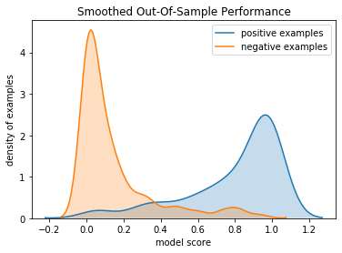
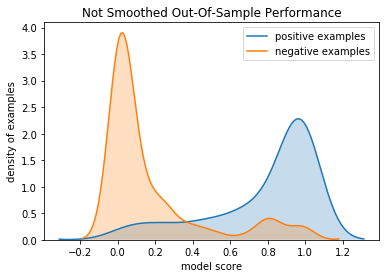

Win Vector LLC's Dr. Nina Zumel has had great success applying [y-aware methods](http://www.win-vector.com/blog/2016/05/pcr_part2_yaware/) to machine learning problems, and working out the detailed [cross-validation methods needed to make y-aware procedures safe](https://arxiv.org/abs/1611.09477).  I thought I would try our hand at y-aware neural net or deep learning methods [here](https://github.com/WinVector/YConditionalRegularizedModel).

This is an example of regularizing a neural net by its activations (values seen at nodes), conditioned on outcome.

The idea is: for a binary classification neural net we ideally want at the very last layer the prediction is 1 when the training outcome is 1 and the prediction is 0 when the training outcome is 0.  Our improvement is to generalize this training criteria in such a way that it can be applied to interior layers of the neural net as follows.

Suppose our training examples are indexed by i for i = 1,...,m and our neural net nodes are labeled by j = 1,...,n.  y(i) is the training outcome which we are assuming is 0/1. d(j) is the depth of the layer the j-th node is in, which ranges from 1 to k, 1 being the input layer (explanatory variables) and k being the output layer.  Define a(j, i) as the activation or value seen at node j (the value after the node's transfer and activation) for training example i.  Assume a(n, i) is the output or prediction layer of the neural net.  a(j, i) varies as the neural net weights are updated during training, we are looking at a(j, i) for a given value of the weights, and will need to re-compute a(j, i) after any training step or weight update.

We can generalize the empirical "match the outputs condition" to the following.  For node-j define the y-conditioned variance as:

     mean(j, Y) := sum_{i = 1,...m; y(i) = Y} a(j, i) / sum_{i = 1,...m; y(i) = Y} 1
     cross(j)   := (mean(j, 0) - mean(j, 1))^2
     var(j, i)  := (a(j, i) - mean(i, j, y(i)))^2
     rat(j, i)  := var(j) / cross(j) 

The intent is rat(j, i) should look a lot like a supervised version of the Calinski and Harabasz variance ratio criterion.  A small value of rat(j, i) can be taken to mean that, for a given j, most of the variation in a(j, i) is associated with variation in y(i). mean(j, 0), mean(j, 1), and cross(j) are all many-example aggregates, for simplicity we will estimate them per-batch and thus prefer large batch sizes for better estimates.

A typical objective function for a binary classification problem is to minimize the following cross-entropy.

     loss(i)    :=  - y(i) log(a(n, i)) - (1 - y(i)) log(1 - a(n, i))
     total_loss := sum_{i = 1,...,m} loss(i)

Minimizing total_loss tends to also make var(n) small relative to cross(n).  This is because the loss tries to concentrate a(n, i) near 1 for all i such that y(i) is 1, and a(n, i) near 0 for all such that y(i) is 0.  For a perfect fit this would imply var(n) = 0 and cross(n) = 1.  So we can consider adding minimizing rat(n, i) as an additional auxiliary term to our loss/objective function.  Of course this doesn't yet add much, as total_loss is already a good objective function on the last-layer or prediction activations.

Now we try something new that may have advantages: add rat(j, i) for intermediate j as additional terms for our objective function.  Define our new regularized loss as:

     w(j)                := (d(j) - 1) / ((k - 1) sum_{a = 2,..,n-1; w(a) = w(j)} 1)
     regularized_loss(i) := loss(i) + alpha sum_{j = 2,...,n-1} w(j) rat(j, i)

The weight w(j) is picked so each node in a layer has the same weight and the early layers, near the explanatory/input variables, get weaker regularization.  alpha is a hyper-parameter specifying the strength of the regularization.  Notice also regularized_loss(i) is per-example, we deliberately have not summed it up.

The overall idea is: later layers in the neural net should have unsurprising values given the training outcome.  So we are adding a simple norm, one of many possible, to try and enforce that.  Or: to reduce over-fit try to minimize non-explanatory variation in the network activations.  Variations of the idea are to make values at each layer unsurprising given the values at the layer after it. One can also think of this as taking ideas from the stationary points of an action, approximating the idea of a Lagrangian or, if we added some useful symmetries, a gauge-like principle.

In this project we demonstrate the effect on a simple data set using Keras and Tensorflow.  Now, Keras doesn't idiomatically supply a simple interface for regularizing activations on all layers.  Keras does have generic loss-functions and per-layer weight regularizers, but attempting to code this effect into those interfaces is going against their intent/design. So we use a couple of engineering tricks to get Keras to do the work for us.

  * We include the dependent or outcome variable y(i) in our neural net input.
  * We build a layer called [TrimmingLayer](https://github.com/WinVector/YConditionalRegularizedModel/blob/master/TrimmingLayer.py) that strips out the y(i) and sends the rest of the inputs for normal processing.
  * We build a special layer called [ScoringLayer](https://github.com/WinVector/YConditionalRegularizedModel/blob/master/ScoringLayer.py) that collects the outputs of all the layers (including the original normal prediction, and the extra outcome value y(i)) and computes the square-root of the regularized loss we have described above.  Some debug-logging of how the adaption is realized can be found [here](https://github.com/WinVector/YConditionalRegularizedModel/blob/master/DebugNet.ipynb).
  * We use [an adapter](https://github.com/WinVector/YConditionalRegularizedModel/blob/master/YConditionalRegularizedModel.py) to allow sklearn style training via Keras/Tensorflow to train the above neural net as a regression (using square-residual loss) against an additional objective function that is identically zero.  The original informative true classification outcome is still part of the net input, though isolated from the standard portion of the net by the TrimmingLayer.  Only the outer regression is told the outcome is to be all zero.
  * After the training we copy the layer weights from the above exotic regression network into a standard network that can then be used to make actual predictions.

The entirety of the above process is demonstrated in [SmoothedNet.ipynb](https://github.com/WinVector/YConditionalRegularizedModel/blob/master/SmoothedNet.ipynb) .  This original example is adapted from [Jason Brownlee's "Binary Classification Tutorial with the Keras Deep Learning Library"](https://machinelearningmastery.com/binary-classification-tutorial-with-the-keras-deep-learning-library/), which we reproduce for clarity [here](https://github.com/WinVector/YConditionalRegularizedModel/blob/master/BaseNet.ipynb).

The estimate out of sample performance of the y-conditional activation regularized network is as graphed below.  We are showing the distribution of predictions conditioned on actual outcome.

This had an accuracy of about 89%.

This had an accuracy of about 84%.

We haven't seen a truly braggable improvement yet (evaluation is noisy, and our regularization introduces one more hyper-parameter), but we need to try this regularization on more data sets and deeper neural nets (where we think the effects will be more pronounced).

